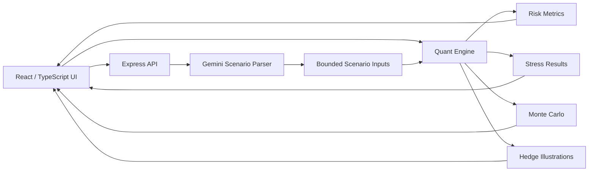

# RiskLab

**AI-assisted quantitative portfolio risk analysis, stress testing, and Monte Carlo simulation.**

RiskLab is a full-stack TypeScript application for exploring portfolio risk through deterministic quantitative models and an AI-assisted scenario interface. The core design principle is simple:

> **AI interprets the question. Deterministic code calculates the risk.**

The application combines portfolio analytics, parametric VaR / Expected Shortfall, factor stress testing, Monte Carlo simulation, correlation analysis, risk attribution, and illustrative hedge modeling in a desktop-style React interface.

## Why I built it

Risk tools often fall into one of two categories: opaque institutional systems or simple dashboards that hide the assumptions behind the numbers. RiskLab is an experiment in making portfolio risk modeling both **interactive** and **inspectable**.

The project also explores a practical pattern for AI-enabled software: use an LLM for natural-language interpretation and explanation, while keeping financial calculations inside a bounded, testable quantitative engine.

## Current status

**v0.1.0 — Quantitative correctness baseline**

Phase 1 focused on validating and correcting the financial math before adding more features. Key corrections include positive-semidefinite correlation handling, bond-duration sign conventions, VaR/CVaR calculations, downside-risk modeling, stress-factor hierarchy, and more defensible hedge labeling.

See [`docs/phase-1-correctness.md`](docs/phase-1-correctness.md) for the detailed validation notes.

## Features

| Area | Capabilities |
| --- | --- |
| Portfolio analytics | Position weights, portfolio volatility, Sharpe/Sortino, risk contribution |
| Correlation | Pairwise correlation matrix with PSD projection before covariance calculations |
| Risk metrics | 95%/99% parametric VaR and Expected Shortfall across multiple horizons |
| Stress testing | Preset and natural-language scenarios with bounded factor shocks |
| Monte Carlo | Geometric Brownian Motion simulation with percentile outcome bands |
| Hedging lab | Illustrative protective puts, put spreads, collars, and beta overlays |
| AI copilot | Natural-language scenario parsing and risk explanations using Gemini |
| Desktop/PWA UX | Installable PWA, keyboard shortcuts, exportable JSON/CSV snapshots |

## Architecture



The AI layer does **not** calculate portfolio risk. It converts narrative scenarios into structured, bounded assumptions. The deterministic engine remains the authority for portfolio mathematics.

More detail: [`docs/architecture.md`](docs/architecture.md)

## Quantitative methodology

RiskLab currently implements:

- portfolio variance using a covariance matrix derived from modeled volatilities and correlations
- positive-semidefinite projection for internally consistent correlation matrices
- marginal and percentage risk contribution
- annualized volatility
- Sharpe ratio
- downside-deviation-based Sortino ratio under the stated normal model
- parametric VaR and Expected Shortfall at 95% and 99% confidence levels
- first-order duration sensitivity for fixed-income stress scenarios
- hierarchical market / technology / semiconductor stress factors
- Black-Scholes option pricing for illustrative hedge economics
- geometric Brownian motion for long-horizon simulation

The full methodology, assumptions, and limitations are documented in [`docs/quantitative-methodology.md`](docs/quantitative-methodology.md).

## Tech stack

- **Frontend:** React 19, TypeScript, Vite, Tailwind CSS
- **Backend:** Node.js, Express, TypeScript
- **AI:** Google Gemini via `@google/genai`
- **Quant layer:** custom TypeScript risk engine
- **PWA:** `vite-plugin-pwa`
- **Testing:** focused quantitative test suite executed with `tsx`

## Run locally

### Prerequisites

- Node.js 20+
- npm or Bun
- Optional: a Gemini API key for AI scenario parsing and the copilot

### Install

Using npm:

```bash
npm install
```

Or with Bun:

```bash
bun install
```

### Configure AI (optional)

Copy the example environment file:

```bash
cp .env.example .env
```

Then add your key:

```env
GEMINI_API_KEY=your_key_here
```

RiskLab still runs without a Gemini key. AI endpoints fall back to deterministic, portfolio-aware behavior where available.

### Start development server

```bash
npm run dev
```

Open `http://localhost:3000`.

### Validate the quantitative engine

```bash
npm run test:quant
```

### Type-check

```bash
npm run lint
```

### Production build

```bash
npm run build
npm start
```

## Quantitative validation

The focused test suite checks invariants that should hold regardless of portfolio composition, including:

- correlation matrix symmetry, unit diagonal, and PSD behavior
- risk-contribution decomposition
- VaR / Expected Shortfall ordering
- fixed-income duration direction under rate shocks
- ticker-specific shock precedence
- market / technology / semiconductor factor hierarchy
- removal of unsupported hedge-floor claims
- Black-Scholes put-call parity and option delta bounds

Run:

```bash
npm run test:quant
```

## AI-assisted development

RiskLab began as an AI-assisted prototype. Generative AI was used to accelerate UI scaffolding and implementation, but the quantitative engine is being manually reviewed, tested, and refactored before the project is treated as technically trustworthy.

One example: an early version used manually specified pairwise correlations that looked plausible individually but produced a correlation matrix with a negative eigenvalue. The engine was corrected to project modeled correlations to a positive-semidefinite matrix before portfolio variance calculations. The correction process is documented rather than hidden because validating AI-generated code is part of the engineering work.

## Project structure

```text
risklab/
├── docs/
│   ├── architecture.md
│   ├── phase-1-correctness.md
│   ├── quantitative-methodology.md
│   └── roadmap.md
├── public/
├── scripts/
├── src/
│   ├── components/
│   ├── types/
│   └── utils/
│       └── quantEngine.ts
├── tests/
│   └── quantEngine.test.ts
├── server.ts
├── package.json
└── vite.config.ts
```

## Roadmap

The next major milestone is to replace hardcoded market assumptions with a market-data layer and support arbitrary real-world portfolio tickers. See [`docs/roadmap.md`](docs/roadmap.md).

## Important limitations

RiskLab is currently a research and engineering project, not a production trading or portfolio-management system. In particular:

- expected returns, volatilities, betas, and some factor exposures are still modeled assumptions
- the application does not yet ingest live or historical market data
- Monte Carlo uses constant-parameter geometric Brownian motion
- hedge outputs are illustrative and do not use a live option chain
- parametric VaR / Expected Shortfall use a normal-return model and can understate fat-tail risk

## Disclaimer

RiskLab is an educational and software-engineering project. It does **not** provide investment advice, trading recommendations, or guarantees of future performance. Model outputs are sensitive to assumptions and should not be relied upon for real financial decisions without independent validation.
