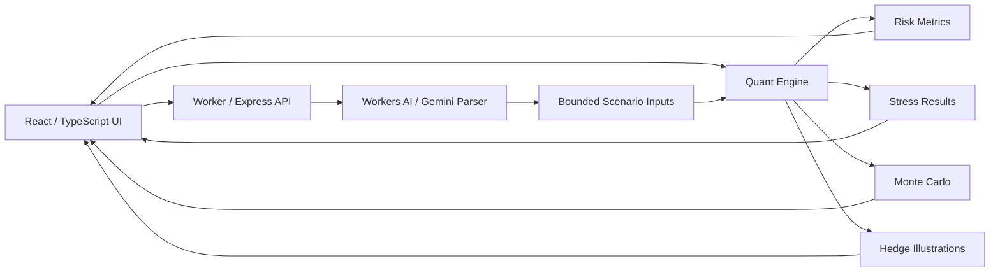

## Deploy to Cloudflare

RiskLab can run as one Cloudflare Worker serving the React app and `/api/*` endpoints. The quantitative engine continues to run in the browser; no database is required for the current app.

See [Cloudflare deployment guide](docs/cloudflare-deployment.md) for GitHub auto-deploy settings and local deployment instructions. The Cloudflare deployment uses Workers AI (Llama 3.3) for scenario interpretation and the copilot, with visibly labeled deterministic fallbacks. The existing Express development and Node deployment commands remain available.

# RiskLab

**AI-assisted quantitative portfolio risk analysis, stress testing, and Monte Carlo simulation.**

RiskLab is a full-stack TypeScript application for exploring portfolio risk through deterministic quantitative models and an AI-assisted scenario interface. The core design principle is simple:

> **AI interprets the question. Deterministic code calculates the risk.**

The application combines portfolio analytics, parametric VaR / Expected Shortfall, factor stress testing, Monte Carlo simulation, correlation analysis, risk attribution, and illustrative hedge modeling in a desktop-style React interface.

## Why I built it

Risk tools often fall into one of two categories: opaque institutional systems or simple dashboards that hide the assumptions behind the numbers. RiskLab is an experiment in making portfolio risk modeling both **interactive** and **inspectable**.

The project also explores a practical pattern for AI-enabled software: use an LLM for natural-language interpretation and explanation, while keeping financial calculations inside a bounded, testable quantitative engine.

## Current status

**v0.2.0 — Investor-friendly MVP**

The current release keeps the validated quantitative engine but changes the product experience for informed individual investors. The default interface answers plain-English questions first — how risky is my portfolio, what drives that risk, what if markets change, and what could the portfolio become — while technical methodology remains available on demand.

See [`docs/product-requirements.md`](docs/product-requirements.md) for the MVP product principles and [`docs/phase-1-correctness.md`](docs/phase-1-correctness.md) for the quantitative validation baseline.

## Features

| Area | Capabilities |
| --- | --- |
| Portfolio onboarding | Clean ticker/allocation builder with sample portfolio and allocation validation |
| Overview | Plain-English risk level, diversification, biggest risk driver, holdings, and optional advanced metrics |
| Diversification | Plain-English view of which holdings move together, powered by the correlation model |
| Risk metrics | 95%/99% parametric VaR and Expected Shortfall across multiple horizons |
| What If? | Preset and natural-language market scenarios with estimated portfolio impact |
| Future | Long-term simulated outcome ranges with technical Monte Carlo details available on demand |
| Advanced lab | Optional illustrative protective puts, put spreads, collars, beta overlays, and AI copilot |
| AI copilot | Natural-language scenario parsing and risk explanations using Cloudflare Workers AI (hosted) or legacy Gemini (local) |
| Desktop/PWA UX | Installable PWA, keyboard shortcuts, exportable JSON/CSV snapshots |

## Architecture


```mermaid
flowchart LR
    UI[React / TypeScript UI] --> API[Worker / Express API]
    UI --> QE[Quant Engine]
    API --> AI[Workers AI / Gemini Parser]
    AI --> B[Bounded Scenario Inputs]
    B --> QE
    QE --> R[Risk Metrics]
    QE --> S[Stress Results]
    QE --> M[Monte Carlo]
    QE --> H[Hedge Illustrations]
    R --> UI
    S --> UI
    M --> UI
    H --> UI
```

The AI layer does **not** calculate portfolio risk. It converts narrative scenarios into structured, bounded assumptions. The deterministic engine remains the authority for portfolio mathematics.

More detail: [`docs/architecture.md`](docs/architecture.md)

## Quantitative methodology

RiskLab currently implements:

- portfolio variance using a covariance matrix derived from modeled volatilities and correlations
- positive-semidefinite projection for internally consistent correlation matrices
- marginal and percentage risk contribution
- annualized volatility
- Sharpe ratio
- downside-deviation-based Sortino ratio under the stated normal model
- parametric VaR and Expected Shortfall at 95% and 99% confidence levels
- first-order duration sensitivity for fixed-income stress scenarios
- hierarchical market / technology / semiconductor stress factors
- Black-Scholes option pricing for illustrative hedge economics
- geometric Brownian motion for long-horizon simulation

The full methodology, assumptions, and limitations are documented in [`docs/quantitative-methodology.md`](docs/quantitative-methodology.md).

## Tech stack

- **Frontend:** React 19, TypeScript, Vite, Tailwind CSS
- **Backend:** Cloudflare Worker for hosting; Node.js / Express for local development; TypeScript
- **AI:** Cloudflare Workers AI (Llama 3.3) for hosting; Google Gemini via `@google/genai` for the legacy local server
- **Quant layer:** custom TypeScript risk engine
- **PWA:** `vite-plugin-pwa`
- **Testing:** focused quantitative test suite executed with `tsx`

## Run locally

### Prerequisites

- Node.js 20+
- npm or Bun
- Optional: a Gemini API key for AI scenario parsing and the copilot

### Install

Using npm:

```bash
npm install
```

Or with Bun:

```bash
bun install
```

### Configure AI (optional)

Copy the example environment file:

```bash
cp .env.example .env
```

Then add your key:

```env
GEMINI_API_KEY=your_key_here
```

RiskLab still runs without a Gemini key. AI endpoints fall back to deterministic, portfolio-aware behavior where available.

### Start development server

```bash
npm run dev
```

Open `http://localhost:3000`.

### Validate the quantitative engine

```bash
npm run test:quant
```

### Type-check

```bash
npm run lint
```

### Production build

```bash
npm run build
npm start
```

## Quantitative validation

The focused test suite checks invariants that should hold regardless of portfolio composition, including:

- correlation matrix symmetry, unit diagonal, and PSD behavior
- risk-contribution decomposition
- VaR / Expected Shortfall ordering
- fixed-income duration direction under rate shocks
- ticker-specific shock precedence
- market / technology / semiconductor factor hierarchy
- removal of unsupported hedge-floor claims
- Black-Scholes put-call parity and option delta bounds

Run:

```bash
npm run test:quant
```

## AI-assisted development

RiskLab began as an AI-assisted prototype. Generative AI was used to accelerate UI scaffolding and implementation, but the quantitative engine is being manually reviewed, tested, and refactored before the project is treated as technically trustworthy.

One example: an early version used manually specified pairwise correlations that looked plausible individually but produced a correlation matrix with a negative eigenvalue. The engine was corrected to project modeled correlations to a positive-semidefinite matrix before portfolio variance calculations. The correction process is documented rather than hidden because validating AI-generated code is part of the engineering work.

## Project structure

```text
risklab/
├── docs/
│   ├── architecture.md
│   ├── phase-1-correctness.md
│   ├── product-requirements.md
│   ├── quantitative-methodology.md
│   └── roadmap.md
├── public/
├── scripts/
├── src/
│   ├── components/
│   ├── types/
│   └── utils/
│       └── quantEngine.ts
├── tests/
│   └── quantEngine.test.ts
├── server.ts
├── package.json
└── vite.config.ts
```

## Roadmap

The next major milestone is to replace hardcoded market assumptions with a market-data layer and support arbitrary real-world portfolio tickers. See [`docs/roadmap.md`](docs/roadmap.md).

## Important limitations

RiskLab is currently a research and engineering project, not a production trading or portfolio-management system. In particular:

- expected returns, volatilities, betas, and some factor exposures are still modeled assumptions
- the application does not yet ingest live or historical market data
- Monte Carlo uses constant-parameter geometric Brownian motion
- hedge outputs are illustrative and do not use a live option chain
- parametric VaR / Expected Shortfall use a normal-return model and can understate fat-tail risk

## Disclaimer

RiskLab is an educational and software-engineering project. It does **not** provide investment advice, trading recommendations, or guarantees of future performance. Model outputs are sensitive to assumptions and should not be relied upon for real financial decisions without independent validation.

### US-listed holdings directory

Both holding pickers search tickers and security names from a committed Nasdaq Trader snapshot:
`public/symbols/us-listed.json`. Sources are Nasdaq-listed and other-listed directories at
https://www.nasdaqtrader.com/dynamic/SymDir/nasdaqlisted.txt and
https://www.nasdaqtrader.com/dynamic/SymDir/otherlisted.txt. The snapshot records download time
and source file creation times. It includes US exchange-listed stocks (including ADRs) and
ETFs; test issues, warrants, rights, preferred issues, notes and closed-end funds are excluded.
It is a listing directory, not a live quote feed; some corporate actions or unusual issue names
may require a refresh or filter adjustment. Refresh deliberately with `npm run refresh:symbols`
and commit the resulting snapshot. Failed downloads preserve the existing file.

Portfolios support up to 30 holdings. The original 15 assets retain their illustrative model
assumptions. Other tickers require an explicit risk proxy from those assets. Actual security
names/tickers remain visible, while volatility, returns, factor sensitivity, pairwise correlation
and preset stress shocks use the proxy. Holdings sharing a proxy have effectively identical
modeled exposure. Proxy selections are shown in the holdings table, preserved in JSON exports
and included in the CSV's Risk Proxy column. Unavailable prices export as blank rather than a
proxy quote. Choose another proxy in Edit Portfolio. Run `npm run test:symbols` for directory,
search and model consistency checks.

### Historical risk models from a public snapshot

Historical mode calculates each covered holding's risk from a committed, dated public dataset,
loaded once and reused in the browser. Changing allocations, adding covered holdings and running
analysis do not call a market-data API. No account, token or backend market-data secret is needed.
The PWA also caches the snapshot. The listing directory remains broader than historical coverage;
unsupported holdings can use the existing, explicitly selected proxy in preset mode. A portfolio
uses one mode consistently, with no hidden mixture of historical and preset covariance estimates.

`npm run refresh:risk-models` deliberately rebuilds `public/models/historical-snapshot.json`
from the publicly readable `post-no-preference/stocks` DoltHub database. The generator uses its
indexed daily closing-price records and dividend/split tables to form total-return indices over
the latest available year. It checks query completeness, valid closes, source dates, minimum
history and availability of corporate-action dates. Missing, short or stale symbols are omitted;
failed refreshes preserve the previous snapshot. Refresh and commit the file when desired;
there is no scheduled job or runtime upstream price fetch. Repeated generator queries have a
one-hour temporary cache to permit resuming downloads; remove `risklab-public-data-cache` from
your system's temporary directory if you need to bypass it for source corrections.

For the selected holdings and SPY benchmark, RiskLab aligns identical daily return intervals,
requires at least 126 common returns, and calculates sample variance/covariance, annualized
volatility (252 days), correlations, beta versus SPY, and annualized arithmetic historical mean
return. The mean supplies the existing simulation/parametric risk drift and is explicitly labeled
as historical, not a forecast. VaR/CVaR still use the normal-distribution model; this does not
turn them into empirical historical VaR. Rate duration and sector stress sensitivities remain
preset assumptions where available; unknown holdings use only their measured market beta in
factor stress tests, with zero unspecified sector/rate loadings. Closing prices alone do not
estimate all macroeconomic transmission paths. No live quote or future return is implied.

The UI and JSON export preserve provider, observation count, historical window, capture time,
correlations and last closing-price date. CSV identifies the risk mode and data-through date.
All holdings in an updated historical portfolio are recalibrated together against the same
snapshot and window. Flat series produce zero volatility with finite risk contributions.

Data attribution: https://www.dolthub.com/repositories/post-no-preference/stocks,
creator `post-no-preference`, licensed CC BY-SA 4.0. RiskLab's stored adjusted indices and derived
historical-model data are adaptations distributed under the same license:
https://creativecommons.org/licenses/by-sa/4.0/. Adjustments and methodology are described above.
This data license does not change the license of unrelated application code. Snapshot and
model data retain source and license metadata. The public dataset is community-maintained;
corporate actions, source corrections and ticker reuse can affect estimates. Inspect the visible
as-of date and coverage before relying on a model.
