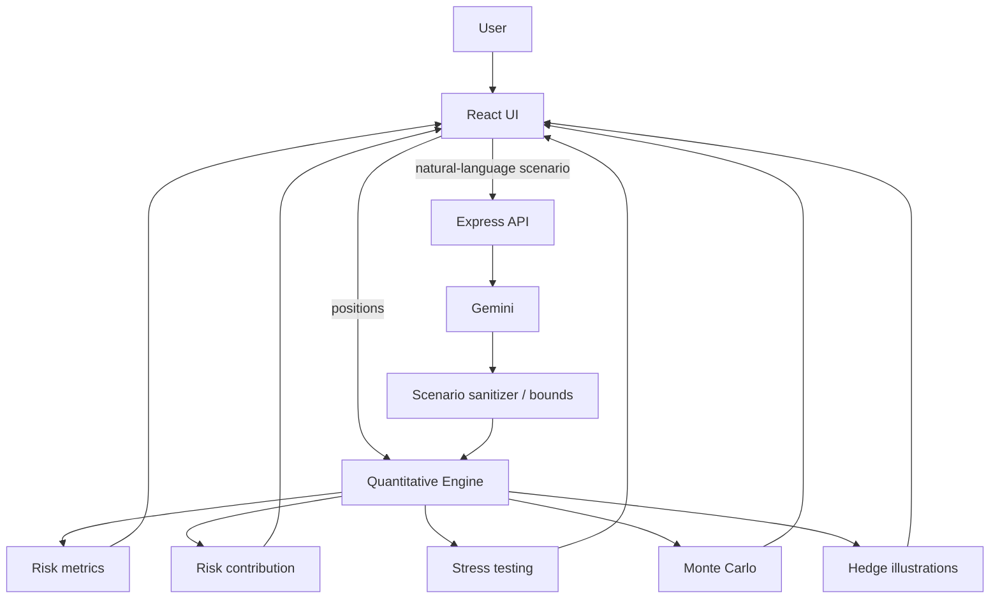
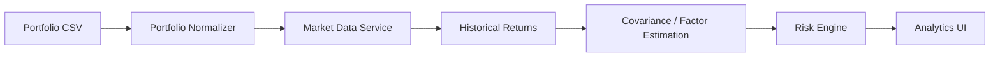

# Architecture

RiskLab is designed around a strict separation between **language interpretation** and **financial computation**.

## Design principle

> The LLM may translate a user's scenario into structured assumptions, but it does not own the portfolio mathematics.

This boundary makes the system easier to test, reason about, and evolve.

## High-level flow

## Frontend

The frontend is a React + TypeScript application organized around several analytical views:

- portfolio risk and VaR
- correlation matrix
- risk contribution
- Monte Carlo simulation
- factor stress testing
- hedging lab

Portfolio edits trigger deterministic recalculation through `src/utils/quantEngine.ts`.

## Quantitative engine

The quantitative engine contains the financial models and has no dependency on Gemini. Its responsibilities include:

- modeled asset metadata
- portfolio normalization
- correlation construction and PSD projection
- covariance and portfolio variance
- risk contribution
- VaR / Expected Shortfall
- downside-risk metrics
- stress testing
- Monte Carlo simulation
- Black-Scholes option pricing
- illustrative hedge economics

The current implementation is intentionally centralized in `quantEngine.ts`. A later architecture phase will split this into focused modules after the market-data interface is established.

## API layer

`server.ts` provides:

- `/api/health`
- `/api/gemini/parse-scenario`
- `/api/gemini/ask-copilot`

The server owns the Gemini credential. The browser never receives the API key.

### Scenario safety boundary

LLM-generated scenarios are sanitized before entering the deterministic engine:

1. unknown or malformed values are normalized
2. numeric factor shocks are clamped to bounded ranges
3. ticker identifiers are validated
4. text fields are length-limited
5. asset-specific percentage shocks are bounded

This does not make an LLM scenario a forecast; it prevents untrusted model output from directly controlling numerical calculations without validation.

## Development / production

In development, Express hosts Vite in middleware mode so API and frontend requests share one server.

In production, Vite builds the browser application and the Express server serves the generated assets plus API endpoints.

## Future architecture direction

The next major boundary is a market-data service:

That will allow RiskLab to replace hand-entered market assumptions with reproducible historical inputs while retaining explicit forward-looking assumptions separately.
